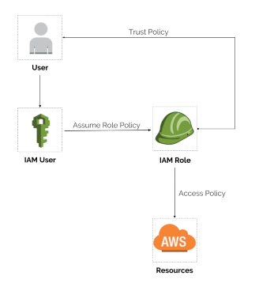

# awsgen

[](https://travis-ci.org/mvallim/aws-gen-cli/builds)

awsgen is the software that manage AWS Security Token Service (STS) and enables you to request temporary, limited-privilege credentials for AWS Identity and Access Management (IAM) users or for users that you authenticate (federated users).
For more detailed information about using this service, go to [Temporary Security Credentials](https://docs.aws.amazon.com/IAM/latest/UserGuide/id_credentials_temp.html).



## Getting Started

These instructions will get you a copy of the project up and running on your local machine for development and testing purposes. See deployment for notes on how to deploy the project on a live system.

### Prerequisites

You will need to have python and pip installed on your machine.

#### On Linux (Debian/Ubuntu)

```
$ sudo apt-get install python python-pip -y
```
Right after having it installed you'll need to get aws-cli and aws-gen.

```
$ sudo pip install awscli awsgen --upgrade --no-cache-dir
```

#### On Windows

For install python go to [Python.org](https://www.python.org/downloads/windows/)

Right after having it installed you'll need to get aws-cli and aws-gen.

```
> pip install awscli awsgen --upgrade --no-cache-dir
```

#### On MacOS (under construction)

Please add instructions here

## Installing

First you need to create an account with aws (please go to [Amazon Website](https://aws.amazon.com/))

Go to the terminal and create a new AWS profile using the following command:

```
$ aws-gen configure \
            --account AWS_ACCOUNT \
            --trust-role-arn TRUSTROLEARN \
            --access-key-id AWS_ACCESS_KEY_ID \
            --secret-access-key AWS_SECRET_ACCESS_KEY
```

##### Parameters:
* __`AWS_ACCOUNT`__: stands for the main name of your project or brand, i.e. __brand-project__ or __littleBanana-tree__. This is important because it will link with your profile later.
* __`TRUSTROLEARN`__: Role you need to create with a Superadmin user allowing you do whatever you need. This role will give the properly permissions to run builds, create/update/delete cloudformation, create new services on AWS, etc.
* __`AWS_ACCESS_KEY_ID`__: stands for the access key you will get once you create a user.
* __`AWS_SECRET_ACCESS_KEY`__: stands for the secret key you will have once you create your user.

After configuring it, you need to create a profile:

```
$ aws-gen create-profile \
            --account AWS_ACCOUNT \
            --profile AWS_PROFILE \
            --region-name AWS_REGION \
            --output AWS_OUTPUT
```

##### Parameters:
* __`AWS_REGION`__: stands for the region you mostly use on your account, where your infrastructure relies.
* __`AWS_OUTPUT`__: We usually use JSON as output format, but there are other options you can explore.
* __`AWS_PROFILE`__: stands for the profile name you want to use. It is important to keep the things organized, so we would recomend to name it follwing the standard __username__@`AWS_ACCOUNT`, i.e. __aboscatto@brand-project__ or __danielpn@littleBanana-tree__.

## Using

### Generating an authenticaded AWS console link

If you need to access the AWS Console using the `TRUSTROLEARN` role, please do the following:

```
$ aws-gen get-link --account AWS_ACCOUNT --profile AWS_PROFILE
```
##### Parameters:
* __`AWS_ACCOUNT`__: stands for the main name of your project or brand, i.e. __brand-project__ or __littleBanana-tree__. This is important because it will link with your profile later.
* __`AWS_PROFILE`__: stands for the profile name you want to use. It is important to keep the things organized, so we would recomend to name it follwing the standard __username__@`AWS_ACCOUNT`, i.e. __aboscatto@brand-project__ or __danielpn@littleBanana-tree__.


### Generating temporary AWS Access key

If you need to access the AWS using access key over the `TRUSTROLEARN` role, please do the following:

```
$ aws-gen get-key --account AWS_ACCOUNT --profile AWS_PROFILE
```
##### Parameters:
* __`AWS_ACCOUNT`__: stands for the main name of your project or brand, i.e. __brand-project__ or __littleBanana-tree__. This is important because it will link with your profile later.
* __`AWS_PROFILE`__: stands for the profile name you want to use. It is important to keep the things organized, so we would recomend to name it follwing the standard __username__@`AWS_ACCOUNT`, i.e. __aboscatto@brand-project__ or __danielpn@littleBanana-tree__.

##### Output:
* __`AWS_ACCESS_KEY_ID`__: The access key ID that identifies the temporary security credentials.
* __`AWS_SECRET_ACCESS_KEY`__: The secret access key that can be used to sign requests.
* __`AWS_SESSION_TOKEN`__: The token that users must pass to the service API to use the temporary credentials.


### Setting active profile

If you need active profile default, please do the following:

```
$ aws-gen set-active-profile --profile AWS_PROFILE
```
##### Parameters:
* __`AWS_PROFILE`__: stands for the profile name you want to use. It is important to keep the things organized, so we would recomend to name it follwing the standard __username__@`AWS_ACCOUNT`, i.e. __aboscatto@brand-project__ or __danielpn@littleBanana-tree__.

### Getting active profile

If you need get active profile, please do the following:

```
$ aws-gen get-active-profile
```

### Listing profiles

If you need list profiles, please do the following:

```
$ aws-gen list-profiles
```

### Deploying with Serverless

Doing the deploy with Serverless should be pretty simple and you need to use the --aws-profile parameter

```
$ sls deploy --aws-profile AWS_PROFILE
```
### Using aws cli

Doing the use with aws cli should be pretty simple and you need to use the --profile parameter

```
$ aws s3 ls --profile AWS_PROFILE
```

### Step-by-step example

Here is an example of how it should look like during the installing:
```
$ sudo apt-get install python python-pip -y
```
```
$ sudo pip install awscli awsgen --upgrade --no-cache-dir
```
```
$ aws-gen configure \
            --account brand-project \
            --trust-role-arn arn:aws:iam::123456789123:role/AWSTrustUserRole \
            --access-key-id AK***************KQ \
            --secret-access-key Y*********************0*******P*******S
```
```
$ aws-gen create-profile \
            --account brand-project \
            --profile aboscatto@brand-project \
            --region-name us-west-2 \
            --output json
```

## Contributing

Please read [CONTRIBUTING.md](CONTRIBUTING.md) for details on our code of conduct, and the process for submitting pull requests to us.

## Versioning

We use [GitHub](https://github.com/mvallim/aws-gen-cli) for versioning. For the versions available, see the [tags on this repository](https://github.com/mvallim/aws-gen-cli/tags). 

## Authors

* **Marcos Vallim** - *Initial work, Test, Documentation* - [mvallim](https://github.com/mvallim)
* **André Boscatto** - *Validation use, Test, Documentation* - [andreboscatto](https://github.com/andreboscatto)
* **Kalianne Rosa** - *Validation use, Test* - [kaliannerosa](https://github.com/KalianneRosa)
* **Daniel Nunes** - *Validation use, Test* - [daspn](https://github.com/daspn)

See also the list of [contributors](CONTRIBUTORS.txt) who participated in this project.

## License

This project is licensed under the BSD License - see the [LICENSE](LICENSE) file for details

## Acknowledgments (under construction)

* Hat tip to anyone whose code was used
* Inspiration
* etc

## Code of Conduct

Everyone interacting in the awsgen project's codebases, issue trackers, chat rooms, and mailing lists is expected to follow the `PyPA Code of Conduct`.
